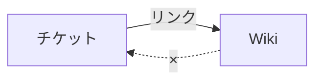
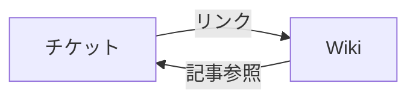

## 0. はじめに

Redmineで議事録とチケット管理の両立に悩んでいるチーム向けに、Redmine Issue References というプラグインを作成しましたので紹介します。
このプラグインは、議事録とチケット管理の断絶を埋め、チームが自然にRedmineを使い続けられる環境を作ることを目的としています。

## 1. プラグインの概要

RedmineのWikiにはチケット番号を `#123` のように書くと、自動でリンクが生成される便利な機能があります。例えば議事録をWikiに書く場合 `#456 の件は次回対応` と書けば、そのままチケットへのリンクになります。

しかし、**チケット側からは「どのWikiページで自分が参照されたか」を知るすべがありません**。チケットの詳細画面を開いても、そのチケットについてどこかで議論されたかどうかはわかりません。

情報の流れは一方通行です。



このプラグインはこの一方通行を双方向にします。



## 2. いままでの運用（よくある風景）

Redmineでチケット管理をしているのになかなかうまく回らない、という現場はめずらしくありません。なぜそうなるのか。よくある2つのパターンを見てみましょう。この状態が続くと、管理者は「チケットが更新されない」「議事録とチケットが分断される」という問題に悩まされます。

### パターンA：議事録はWikiに、チケットには転記する

打ち合わせでは複数のチケットをまとめて議論します。進捗を確認したり、対応の方向性を決めたり。こうした内容は、議事録としてWikiにまとめておけばあとで見返しやすくなります。

しかし、このやり方には落とし穴があります。チケットを開いても「この件がいつの打ち合わせで、どう議論されたか」がわかりません。そのため、打ち合わせのあとに議事録からチケットへの転記作業が発生します。

これが地味に面倒くさい。そして、だんだんチケットを更新しなくなり、やがてチケット管理そのものが形骸化したり、チケット管理ツールって使えないじゃん、という雰囲気になったりします。

### パターンB：打ち合わせ中にチケットへ直接書き込む

最初からチケットを画面に映しながら打ち合わせをして、その場でチケットに書き込んでいく方法もあります。転記不要で、チケットに課題の動きが記録されていく点は理想的です。

ただしこのやり方は、「打ち合わせ議事録」という形では残りません。いつ・誰と・何を議論したか、という打ち合わせ単位の俯瞰がしにくくなります。また、参加者や他の課題との関連をチケットごとに書くのも手間がかかるため、打ち合わせ中の書き込みは最小限になりがちです。後から文脈を追おうとしても、バラバラなコメントからは全体像がつかみにくい状態になります。

## 3. 本プラグインで解決

**Redmine Issue References プラグイン**は、WikiページにチケットIDが書かれると、チケット詳細画面に自動で参照情報を表示します。


ユーザーがすることは「Wikiに議事録を書く」だけ。それだけで、チケット側から「このチケットはいつ・どのWikiページで・どのような文脈で言及されたか」が確認できるようになります。

転記作業は不要になります。WikiとチケットはIssue Referencesによって自動的に結びつきます。

パターンAで運用していたチームはいままで通り運用するだけでチケットからどの打ち合わせで議論したかをたどることができます。パターンBで運用していたチームは、あらかじめ議論するチケット番号のアジェンダを作成して打ち合わせし、その場で／あとで、議事録として整理。すくなくともいままでよりは見通しがよくなるのではないでしょうか。

## 4. インストール・設定

### 動作要件

- Redmine 5.0.0 以上

### インストール手順

**1. プラグインをpluginsディレクトリに配置します。**

```bash
cd {REDMINE_ROOT}/plugins
git clone https://github.com/Mattani/redmine_issue_references.git
```

**2. マイグレーションを実行します。**

```bash
cd {REDMINE_ROOT}
bundle exec rake redmine:plugins:migrate RAILS_ENV=production
```

**3. Redmineを再起動します。**

```bash
sudo systemctl restart httpd   # Apache の場合
# または
sudo systemctl restart puma    # Puma の場合
```

### プロジェクトモジュールの有効化

インストール後、プラグインを使いたいプロジェクトで「チケット参照」機能を有効にします。

### アンインストール手順

**1. マイグレーションをロールバックします。**

```bash
cd {REDMINE_ROOT}
bundle exec rake redmine:plugins:migrate NAME=redmine_issue_references VERSION=0 RAILS_ENV=production
```

**2. プラグインディレクトリを削除します。**

```bash
rm -rf {REDMINE_ROOT}/plugins/redmine_issue_references
```

**3. Redmineを再起動します。**

```bash
sudo systemctl restart httpd   # Apache の場合
# または
sudo systemctl restart puma    # Puma の場合
```

## 5. 使い方

基本的な使い方は非常にシンプルです。

### Step 1: Wikiに議事録を書いて保存

保存時に自動でチケット参照が抽出・記録されます。ユーザーの追加操作は不要です。

```markdown
## 2026-03-29 進捗会議

日時: 2026-03-29
参加者: 山田、鈴木、田中

### 議論内容／決定事項

#2419 決裁APIエラー問題
3月後半から決済失敗率が上昇している。鈴木が調査する。

#2426 管理画面CSV出力の文字化け
議論の中でリトライ設計が未整備であることが判明し、別チケットで整理する
→ #2420 決済APIリトライ設計見直し を新規作成
```

### Step 2: チケット詳細でWiki参照を確認する

チケット `#2426` の詳細画面を開くと、説明欄のすぐ下に「Wiki参照 (1件)」セクションが表示されます。Wikiには #2419 のことも議論していますが、この部分は #2426 の参照がありませんので参照として表示されません。


参照には次の情報が表示されます。

- 参照元WIkiページのタイトル（リンク付き）
- チケットIDが登場する段落のテキスト（テキストブロック）
- コンテキスト情報（Wikiページ先頭セクションの本文。日時・参加者などの会議情報）
- 最終更新日時と更新者
- New / Updated バッジ（新しい参照・更新された参照を一目で識別）

## 6. プラグインの機能

本プラグインの機能は、ここまで説明したとおり、Wikiにチケット番号が書かれると、チケットの詳細画面からそのWikiへの逆参照ができるようになることです。その他の機能は以下のとおりです。

### 更新状況の把握（バッジ）

新規作成された参照・更新された参照に **New** / **Updated** バッジが付きます。直近の参照をひと目で把握できます。

### 参照の表示（詳細／簡易）

「簡易表示」ではWikiページのタイトルとチケット参照されている行のみ表示されます。「詳細表示」ではWikiのはじめにかかれているコンテキスト情報（いつ、だれが参加したか等）と、チケット参照されたテキストブロック全体が表示されます。ヘッダーの切替リンクで即時に切り替えられます。

### 参照の管理（非表示／再表示）

誤検知や不要な参照を「非表示」にできます。非表示にした参照はデフォルトでは一覧から除外されます。「すべて表示（非表示含む）」ボタンを押すと、非表示の参照が灰色で区別されて表示されます。非表示・再表示の状態はDBに保存され、誰が画面を開いても同じ状態が反映されます。

### 参照の探索（フィルタ・ソート）

テキストボックスにキーワードを入力すると、ページタイトル・テキストブロック・コンテキスト情報の中で部分一致する参照だけが表示されます（クライアント側処理のため即時反映）。

並び替えは「新しい順」「古い順」「タイトル昇順」「タイトル降順」の4種類から選べます。

### 参照の活用（転記）

チェックボックスで参照記事を選択し、チケットのコメントに転記できます。複数チェックすればまとめて転記できます。

- **チケット編集中（コメント入力中）のとき**: 「選択した項目を転記」ボタンをクリックすると、カーソル位置に挿入されます。

- **編集していないとき（閲覧モード）**: 「選択した項目をコピー」ボタンをクリックするとクリップボードにコピーされます。

転記することで、通常のRedmineの追記情報として履歴に残すことができます。（非表示／再表示機能とあわせて、転記済みの参照を非表示にする、などの運用も可能かとおもいます）

## 7. プロジェクト設定

プロジェクトの「設定」→「チケット参照」タブで以下の項目をプロジェクト単位で設定できます。


### バッジ表示期間

New / Updated バッジを表示する日数を設定します（デフォルト: 7日、最大: 31日）。`0` に設定するとバッジは表示されなくなります。

### 抽出するコンテキスト情報

チケット詳細に表示するコンテキスト情報（ページ先頭セクションの本文）をさらに絞り込みます。

議事録の先頭セクションに日時・参加者・会議名など複数の情報が書かれている場合、全行ではなく `日時` `参加者` といったキーワードにマッチする行だけを表示対象にできます。

設定しない場合は先頭セクションの本文全行が表示されます。

### 抽出する見出しセクション

チケットIDを探す「対象範囲」を特定のセクション（見出し）に絞り込みます。

例えば `決定事項` と設定すると、`## 決定事項` という見出しのセクション内にチケットIDが書かれている場合のみ参照として抽出されます。 `## アジェンダ` に書かれたチケットIDは無視されます。

設定しない場合はWikiページ全体が対象になります。複数のキーワードを1行に1つずつ記入でき、照合は部分一致で行われます。

## 8. 技術的な実装

### Redmineのフック機構を利用

Wikiページが保存されると `controller_wiki_edit_after_save` フックが発火します。プラグインはこのフックを受けて参照の抽出・保存処理を実行します。Redmineコアを改変せず、フックのみで動作するため、他のプラグインとの干渉リスクを最小限に抑えています。

WikiController → WikiContent#save → フック発火 → IssueReference更新

### データ構造

このプラグインが使用するDBテーブルは2つです。
（RailsのActionRecordによりモデルにアクセスします）

| テーブル | 用途 |
| --- | --- |
| `issue_references` | 抽出した参照情報（テキストブロック・コンテキスト情報・メタデータ）を1チケット×1Wikiページで1レコード保存 |
| `issue_reference_settings` | プロジェクト単位の設定（バッジ日数・抽出キーワード等） |

参照情報はWikiページの保存のたびに最新の内容で上書きされます。チケットIDがWikiページから消えた場合はそのレコードが削除されます。

### Markdown / Textile 両対応パーサ

Redmineのテキスト書式設定に応じてパーサを自動選択します。
コードブロック・インラインコード・引用ブロック・URLフラグメント（`https://example.com/#123`）内のチケットIDは除外対象として処理されます。

- **Markdown（CommonMark）**: `commonmarker` gem によるAST解析
- **Textile**: Redmineの組み込みフォーマッタを利用

### プロジェクト設定タブの追加

`ProjectsHelperPatch` を使用して、コアのソースファイルを改変せずにプロジェクト設定画面に「チケット参照」タブを追加しています。

## 9. おわりに

「Redmineでチケット管理始めたけど、打ち合わせした内容をチケットに転記するのは大変だ」とか、「チケット管理だけだと打ち合わせとしてまとめた俯瞰ができないし、見通しが悪い」とかで、結局Redmineでのタスク管理をあきらめてしまった、という経験をされた方は多いのではないかと思います。これらは、運用の問題ではありません。本プラグインで、チケット管理と議事録管理の断絶を埋め、Redmine運用の負荷を下げることができます。これにより、チケット管理が自然に続けられる環境に貢献できれば幸いです。

リポジトリはこちらです。フィードバック・Issue・PR歓迎します。

<https://github.com/Mattani/redmine_issue_references>

No ticket, No work!!
